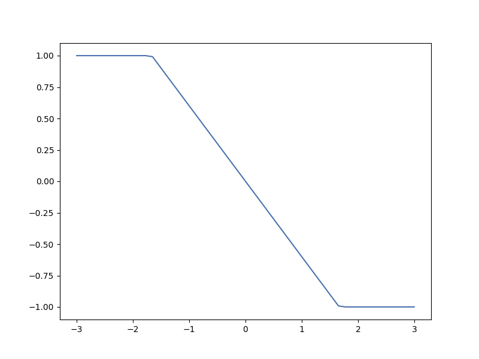
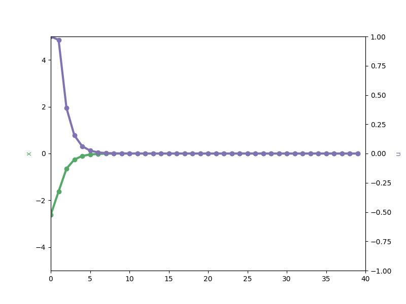

# RL and Optimal Feedback Control

系统方程：
$$
\dot{x}(t)=f(x(t))+g(x(t))u(t)
$$
代价函数：
$$
J(t_0,x_0,u(\cdot))=\int^{\infty}_{t_0}r(x(\tau;t_0,x_0,u(\cdot)),u(\tau))d\tau
$$
将$r$设置为仿射二次型：
$$
r(x,u)\equiv Q(x)+u^TRu
$$
value function 为：
$$
V^*(x)\equiv \inf_{u[t,\infty]}{J(t,x,u(\cdot))}
$$
控制律(状态反馈控制)：
$$
u^*(x)=-\frac{1}{2}R^{-1}g^T(x)(\bigtriangledown V^*(x))^T
$$
为什么设置的最优控制与系统的动力学部分不相关$f(x)$？为什么没有引入进去？$g(x)$是关于系统驱动器和响应的关系。

引入驱动器幅值的约束，诸如$\phi(u)=u^ctanh(u)=\psi(u)$的构造函数来实现约束
$$
\bar{u}^*(x)\equiv -\psi(\frac{1}{2}R^{-1}g^T(x)(\bigtriangledown V^*(x))^T)
$$
因为这个在构造代价函数的时候当u接近上下界限的时候会产生无穷大的代价（由$arctanh()$函数产生的），从而使优化算法产生能够满足驱动器约束条件的控制律

----------------

# Model predictive control: theory, computation, and design (2nd edition)

exp: linear quadratic MPC

discrete system dynamics:
$$
\begin{aligned}
x^+=f(x,u):&=x+u \ where \ u\in [-1,1]\\
stage \ cost&:l(x,u):=\frac{1}{2}(x^2+u^2)\\
terminal \ cost&:V_f(x)=\frac{1}{2}x^2
\end{aligned}
$$
考虑时间窗口为2
$$
V_N(x(0),x(1),x(2),u(0),u(1))=\frac{1}{2}(x(0)^2+x(1)^2+x(2)^2+u(0)^2+u(1)^2)
$$
约束为：
$$
\begin{aligned}
x(0)&=0\\
x(1)&=x(0)+u(0)\\
x(2)&=x(1)+u(1)\\
u(0)&\in[-1,1]\\
u(1)&\in[-1,1]
\end{aligned}
$$
suppose $\mathbf{u}=[u(0),u(1)]$
$$
\begin{aligned}
V_N(x,\mathbf{u})&=\frac{3}{2}x^2+[2x\quad x]\mathbf{u}+\frac{1}{2}\mathbf{u’Hu}\\
where \ \mathbf{H}&=\begin{bmatrix} 3&1\\1&2 \end{bmatrix}
\end{aligned}
$$
对代价函数进行求解，可以得到$u(0)$的解为$\Kappa_N(x)$
$$
x^+=x+\Kappa_N(x) \quad \Kappa_N(x)=-sat(\frac{3}{5}x)
$$

